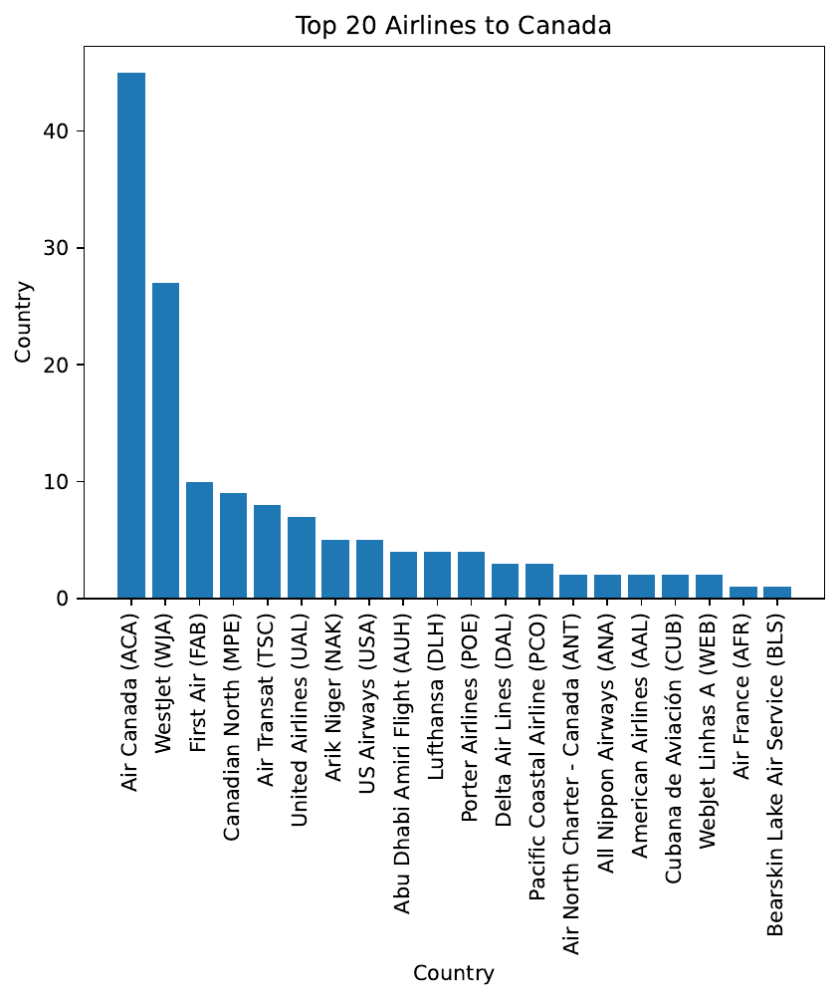
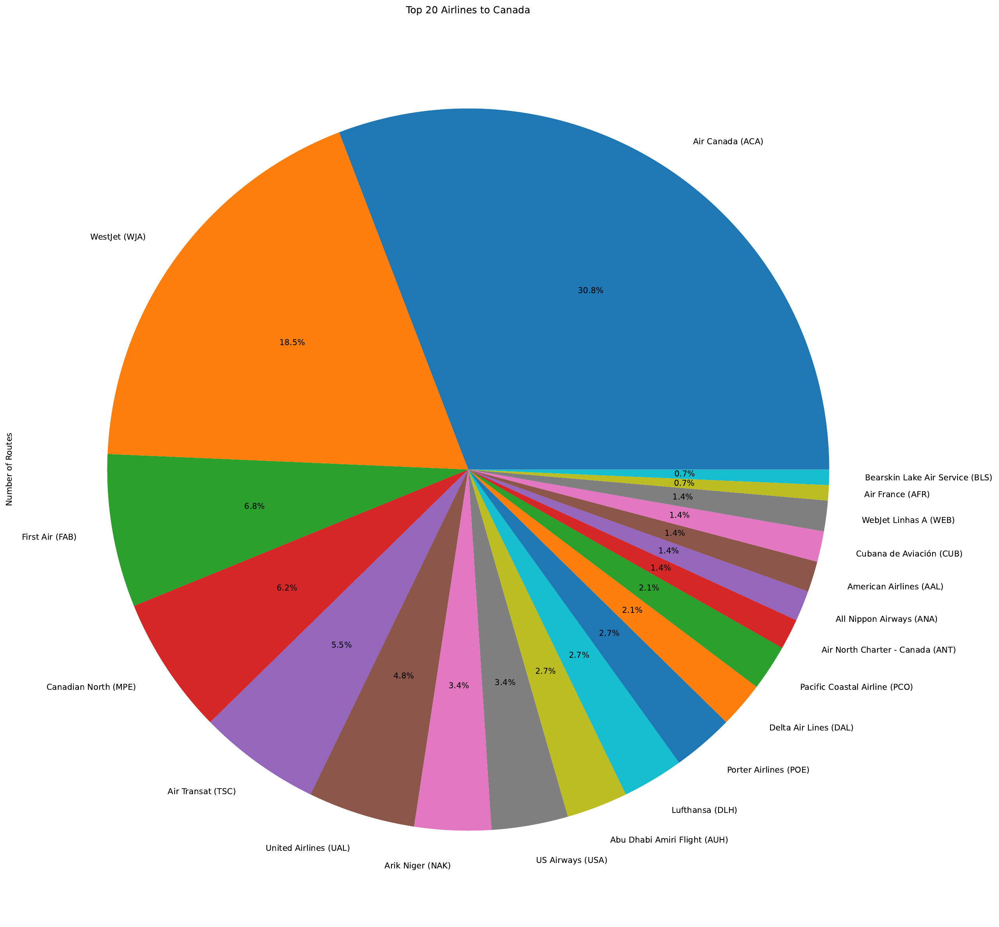
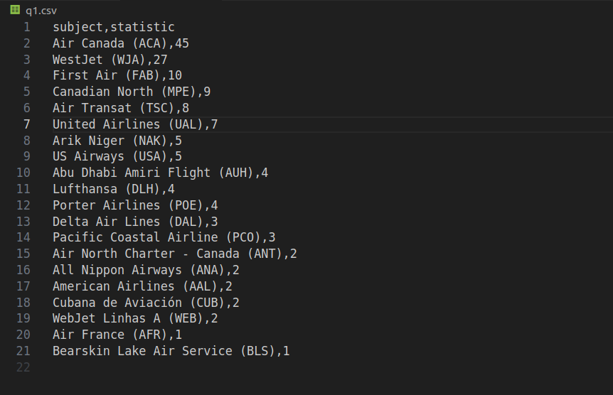

# Route Manager

## Description

The Route Manager is a Python program designed to handle airline routes data and generate insightful analytics. It enables users to address specific inquiries about the data and visualize the results using bar or pie graphs.

## Table of Contents

1. [Features](#features)
2. [Usage](#usage)
3. [Output](#output)
4. [Test Scenarios](#test-scenarios)
5. [Data Source](#data-source)

## Features

- Processes airline routes data to generate descriptive analytics.
- Addresses specific questions about the data, such as:
    - **q1:** Identifying the top 20 airlines offering the highest number of routes to Canada.
    - **q2:** Determining the top 30 countries with the least number of routes as the destination country.
    - **q3:** Listing the top 10 destination airports.
    - **q4:** Identifying the top 15 destination cities.
    - **q5:** Finding the unique top 10 Canadian routes with the greatest difference between destination and origin altitudes.

## Usage

- Ensure Python3 is installed on your system.
- Install required Python libraries (numpy, pandas, matplotlib, and csv_diff for testing).
- Run `route_manager.py` with appropriate arguments to address specific questions and generate graphs.
    ```python
    # Example: Create a bar graph for question 1
    ./route_manager.py --AIRLINES="airlines.yaml" --AIRPORTS="airports.yaml" --ROUTES="routes.yaml" --QUESTION="q1" --GRAPH_TYPE="bar"

    # Example: Create a pie graph for question 1
    ./route_manager.py --AIRLINES="airlines.yaml" --AIRPORTS="airports.yaml" --ROUTES="routes.yaml" --QUESTION="q1" --GRAPH_TYPE="pie"
    ```

## Output
- Example bar graph for Question 1:

    
    <br></br>

- Example pie graph for Question 1:

    
     <br></br>

- Example CSV file for Question 1:

    
     <br></br>

## Data Source

The datasets utilized in this project are sourced from [Kaggle](https://www.kaggle.com/datasets/arbazmohammad/world-airports-and-airlines-datasets).

## Test Scenarios

- Run `./tester` for automated testing based on predefined test scenarios for all questions, or './tester' followed by a question number to test a specific question. For instance, './tester 3' tests the third question.